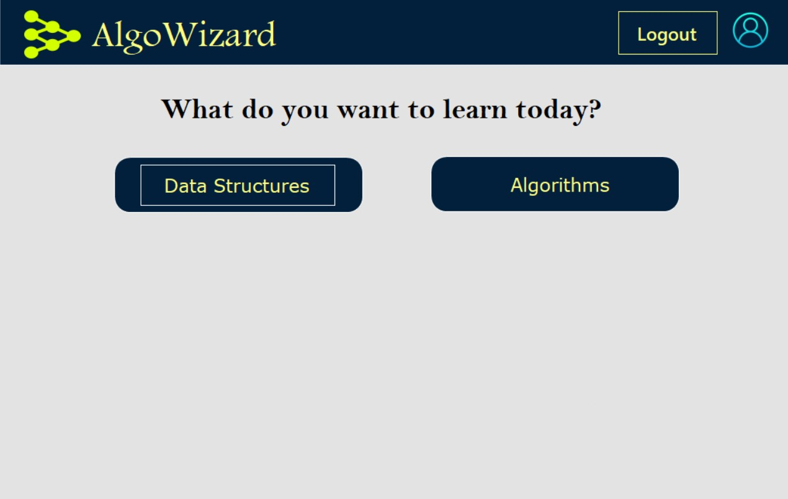
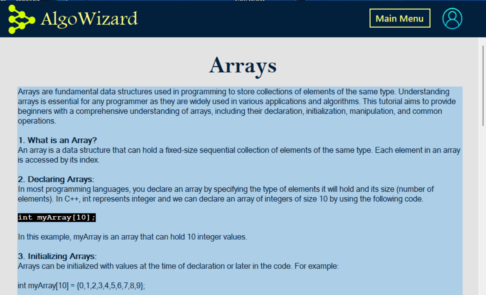
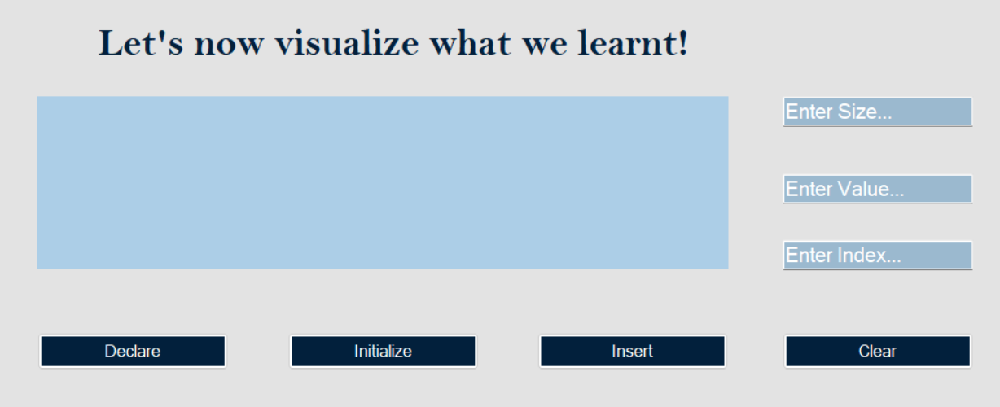
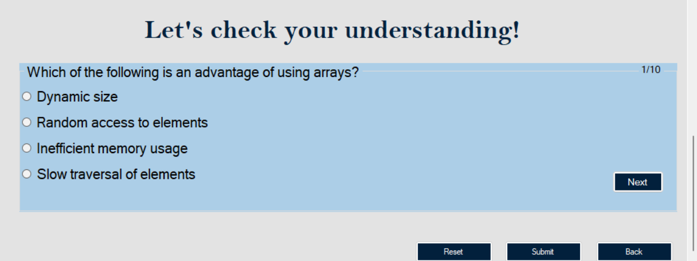
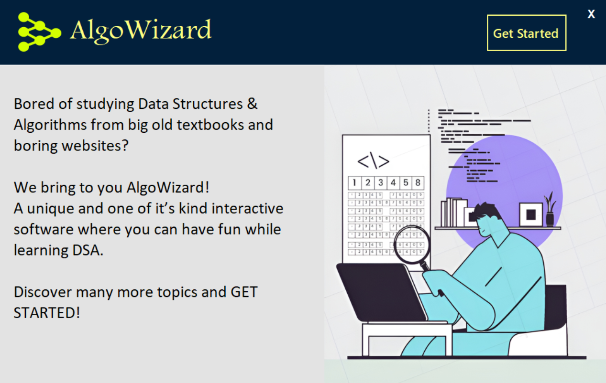
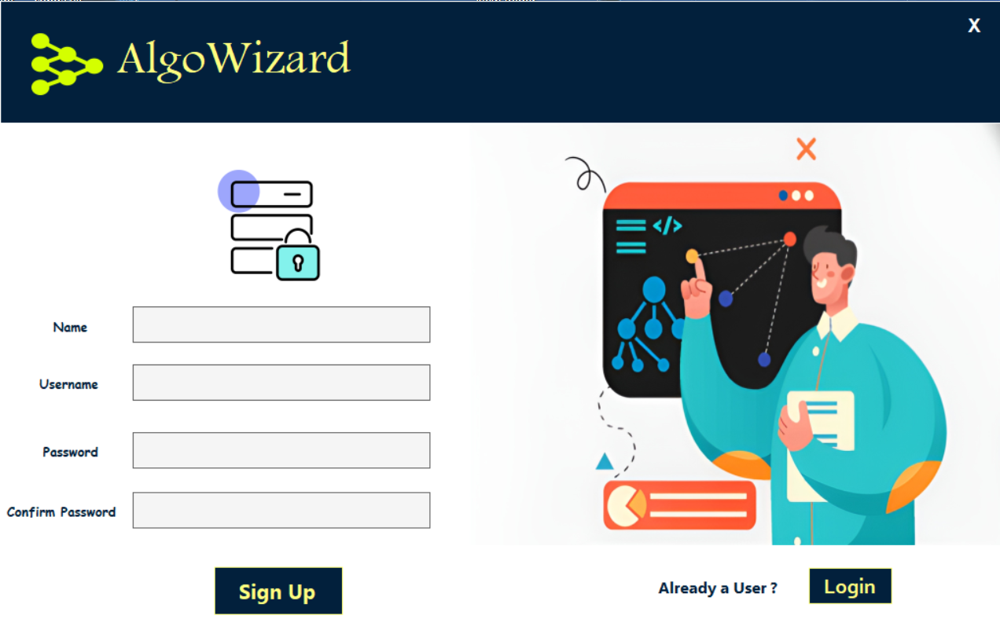
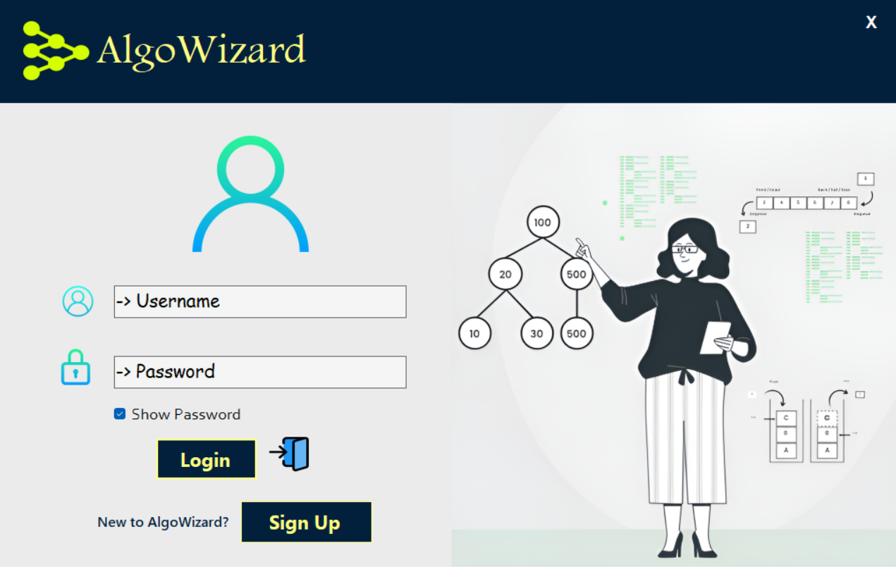

# AlgoWizard


AlgoWizard is a software application designed to educate students on the fundamental concepts of “Data Structures” through interactive learning modules, visuals, and quizzes to improve comprehension and engagement. Basic topics like Searching, Sorting, Arrays, Stacks, Queues, Linked Lists, and so on have been covered.

This application has been built as a Windows Forms application in VB.NET. It uses MySQL for data storage and retrieval. This project has been made as a part of the course CS346: Software Engineering Laboratory, Spring 24.

# Table of Contents

- [AlgoWizard](#algowizard)
- [Table of Contents](#table-of-contents)
- [Brief Overview](#brief-overview)
- [Demo](#demo)
- [Installation](#installation)
- [Database Schema](#database-schema)
- [Design of the Software](#design-of-the-software)

# Brief Overview
[(Back to top)](#table-of-contents)

The goal is to develop a user-friendly software solution that provides organized learning modules on a variety of data structures and algorithms. To make learning easier, the program includes step-by-step explanations, visual aids, and interactive aspects. Quizzes and assessments have been implemented to test students’ understanding and encourage learning.

Key features of the Data Structures Learning Software include:

  - Step-by-step explanations of fundamental data structure concepts.
  - Interactive learning modules with visualizations and demonstrations.
  - Quizzes to test comprehension and reinforce learning.
  - Progress tracking to monitor learning achievements over time.

The Data Structures Learning Software covers the following topics:

  - Searching Algorithms which include Bubble, Insertion and Merge Sort
  - Sorting Algorithms which include Linear and Binary Search
  - Arrays
  - Stacks
  - Queues
  - Linked Lists
    
Each learning module includes instructional content, interactive demonstrations, and quizzes tailored to the specific topic.

# Demo
[(Back to top)](#table-of-contents)

Here is a short demo of the deployed web application.

https://github.com/SanKolisetty/AI-Image-Classifier/assets/95172001/0ebe3ffb-4afe-4a7b-96d3-80ce5e7ce99f

# Installation
[(Back to top)](#table-of-contents)

The following are required to set up and run the software: 

- **Visual Studio 2010**: IDE for running the project
- **MySQL**: For creating databases required for the project
- **MySQL Connector/NET**: Required for connecting database to the project

Open Git Bash and change the directory to the location where the repository is to be cloned. Then, type the following commands.

```shell
  git init
```
```shell
  git clone https://github.com/SanKolisetty/AlgoWizard.git
```
The repository has been cloned in your folder. Now, we need to install the dependences. Please note that we were instructed to implement this project in Visual Studio 2010. We have used MySQL for creating databases required. Thus, install MySQL from this [link](https://dev.mysql.com/downloads/installer/) considering the requirements of your PC.

After MySQL has been installed, create the database as instructed in the SQL query uploaded in the repository.

To connect the Windows Application Form with the database in MySQL, we require MySQL Connector/NET which can be downloaded from [here](https://downloads.mysql.com/archives/c-net/). Since we had to use Visual Studio 2010, the version of the connector that works with this is 6.5.4. After installing the connector, we need to create the connection between the database and the current project. For this, open the .sln file using Visual Studio 2010 and right-click on the folder of the project and the drop-down menu given [here](https://github.com/SanKolisetty/AlgoWizard/blob/main/Images/Adding%20Reference.png) will be shown.

Now, click on `Add Reference` and go to `Browse`. Now follow this path

```shell
  C:\Program Files (x86)\MySQL\MySQL Connector Net 6.5.4\Assemblies\v4.0
```
and select `MySQL.Data.dll`. This creates the connection we require between the Database and the Windows Application Form.

The software is all set up to run.

# Database Schema
[(Back to top)](#table-of-contents)

We have created a Database by the name `swe_assign2`. It contains 10 tables.

- **users**: Stores all the details of the user and their progress so far
- **array**: Stores the quiz questions of user
- **stack**: Stores the quiz questions of stack
- **queue**: Stores the quiz questions of queue
- **linkedlist**: Stores the quiz questions of linked list
- **linear_search**: Stores the quiz questions of linear search
- **binary_search**: Stores the quiz questions of binary search
- **bubble_sort**: Stores the quiz questions of bubble sort
- **insertion_sort**: Stores the quiz questions of insertion sort
- **merge_sort**: Stores the quiz questions merge sort

A picture of the database schema which contains the details of each table is given in the next section.

# Design of the Software
[(Back to top)](#table-of-contents)

We had four weeks to develop the software. Dividing the time given to three main periods, i.e. creating a proposal, starting out and completion of the software, here is a dive into the three stages of the software developement.

- **Creating a Proposal**<br>
 In this stage, we made a 10 page document outlining the requirements and have drawn dataflow diagrams and designed the interface. Database Schema and Level 1 DFD of the software has been given below.

<p float="left">
  
   
</p>

- **Starting Out** <br>

  We have followed the `Incremental Model` of software developement process. Thus, we started with the basic features like main menu for selection of learning topic and visualization of each topic. Below are the pictures of textual information, interactive visualization and quiz added as a part of the initial stages of the developement process.

<p float="left">
  
   
</p>

<p float="left">
  
   
</p>

- **Completion of the Software** <br>
In the final stages of the software, we have further enhanced our software by adding extra features like
  * **User authentication to keep track of the user's progress:** <br>
  We use the `users` database to store the details of the user. The username and password are checked in the database to login the user. Otherwise, the user has to create an account which add the details of the user to the database for the user to directly login the next time.
  * **Profile page to show the user's progress in each topic:**<br>
    Since we have added user authentication to the software, we can always access the user's details from the database using the `username`, which is the primary key of the table `users`. These details are shown to the user in the profile page.

<p float="left">
  
   
   
</p>

  * **Randomization of quiz questions:** <br>
    We have a set of 15 questions for each topic stored in a table in the database. Randomly, ten questions are shown to the user for the quiz. After the user attempts the quiz and submits it, his/her responses are checked agains the correct options in the database and progress of the user in that specific topic is modified to the maximum of the current progress and the score in the quiz where progress is equal to the number of questions answered correctly by the user. In case of searching and sorting, since we have sub-topics, the mean of the progress in each of the sub-topics is shown as the progress for that topic.

# Authors
[(Back to top)](#table-of-contents)

**Team 8B:** Sahil Danayak, Sanjana Kolisetty, Sannidhi Hemanth, Satyarth Gupta, Shally Kandoi, Shashank Kumar


